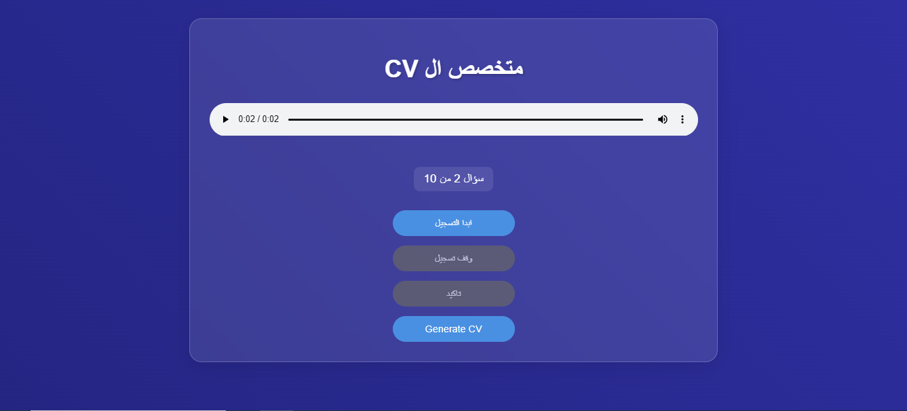

# CV Voice - Professional CV Generator

**CV Voice** is an innovative project designed to help users create professional CVs in Arabic, tailored specifically for Egyptian users. The project leverages voice input to collect user responses, transcribes the audio into text, and generates a well-structured, professional CV using OpenAI's GPT-4 model. The system is built with Flask for the backend, HTML/CSS for the frontend, and integrates OpenAI's Whisper for audio transcription and GPT-4 for CV generation.



## Features

- **Voice Input**: Users can record their answers to predefined questions using their microphone.
- **Audio Transcription**: The system transcribes the recorded audio into text using OpenAI's Whisper model.
- **CV Generation**: The transcribed text is processed by a custom GPT-4 assistant to generate a professional CV in Arabic.
- **User-Friendly Interface**: A simple and intuitive web interface guides users through the process of recording their answers and generating their CV.
- **Professional Formatting**: The generated CV is formatted with clear sections, bold headers, and bullet points for readability and professionalism.

## Project Structure

```
Root/
├── answers.txt                  # Stores transcribed answers from user recordings
├── creatModel.py                # Script to create the GPT-4 assistant
├── data/
│   └── data.txt                 # Additional data or configurations (if needed)
├── index.html                   # Frontend HTML file for the web interface
├── static/
│   ├── audio/                   # Directory for storing audio files (questions)
│   └── styles.css               # CSS file for styling the web interface
├── uploads/                     # Directory for storing uploaded audio files
├── useModel.py                  # Script to interact with the GPT-4 assistant
└── web.py                       # Flask backend for handling web requests
```

## Installation

### Prerequisites

- Python 3.8 or higher
- Flask
- OpenAI Python SDK
- A valid OpenAI API key

### Steps

1. **Clone the Repository**:
   ```bash
   git clone https://github.com/yourusername/CV-Voice.git
   cd CV-Voice
   ```

2. **Install Dependencies**:
   ```bash
   pip install -r requirements.txt
   ```

3. **Set Up OpenAI API Key**:
   - Create a `.env` file in the root directory and add your OpenAI API key:
     ```plaintext
     OPENAI_API_KEY=your_openai_api_key_here
     ```

4. **Run the Flask Application**:
   ```bash
   python web.py
   ```

5. **Access the Web Interface**:
   - Open your browser and navigate to `http://127.0.0.1:5000/`.

## Usage

1. **Start Recording**:
   - Click the "ابدأ التسجيل" (Start Recording) button to begin recording your answer to the current question.
   - Click "وقف تسجيل" (Stop Recording) when you're done.

2. **Submit Answer**:
   - After stopping the recording, click "تاكيد" (Submit) to upload and transcribe your answer.
   - The transcribed text will be saved in `answers.txt`.

3. **Generate CV**:
   - After answering all questions, click "Generate CV" to generate your professional CV.
   - The generated CV will be displayed on the page in a clean, formatted layout.

## Customization

### Adding Questions

To add or modify the questions, update the `audioFiles` array in `index.html` with the paths to your new audio files. Ensure the audio files are placed in the `static/audio/` directory.

### Modifying CV Format

The CV format is controlled by the GPT-4 assistant. You can modify the instructions in `creatModel.py` to change the structure, language, or style of the generated CV.

### Changing Assistant Behavior

To change how the assistant processes the answers, modify the `ask_assistant` function in `useModel.py` or `web.py`. You can adjust the prompts, cleaning rules, or output format as needed.

## Example CV Output

The generated CV will be structured as follows:

```
الاسم الكامل: محمود هاني فتح الله
الوظيفة المطلوبة: مطور برمجيات

المؤهلات الأكاديمية:
- شهادة في علوم الكمبيوتر من جامعة القاهرة (2023)

الخبرات العملية:
- مطور برمجيات في شركة الفلانين (6 أشهر)

المهارات:
- برمجة بايثون، جافا، سي++
- العمل مع قواعد البيانات

اللغات:
- العربية (اللغة الأم)
- الإنجليزية (متقدم)
```

## Contributing

Contributions are welcome! Please fork the repository and submit a pull request with your changes. For major changes, please open an issue first to discuss what you would like to change.

## License

This project is licensed under the MIT License. See the [LICENSE](LICENSE) file for details.

## Acknowledgments

- **OpenAI** for providing the Whisper and GPT-4 models.
- **Flask** for the web framework.
- **All contributors** who helped in developing and testing this project.

---

**CV Voice** is designed to make the process of creating professional CVs simple, efficient, and accessible to everyone. Whether you're a job seeker or a recruiter, this tool will help you create high-quality CVs with ease.

<!-- auto edit #24 -->
